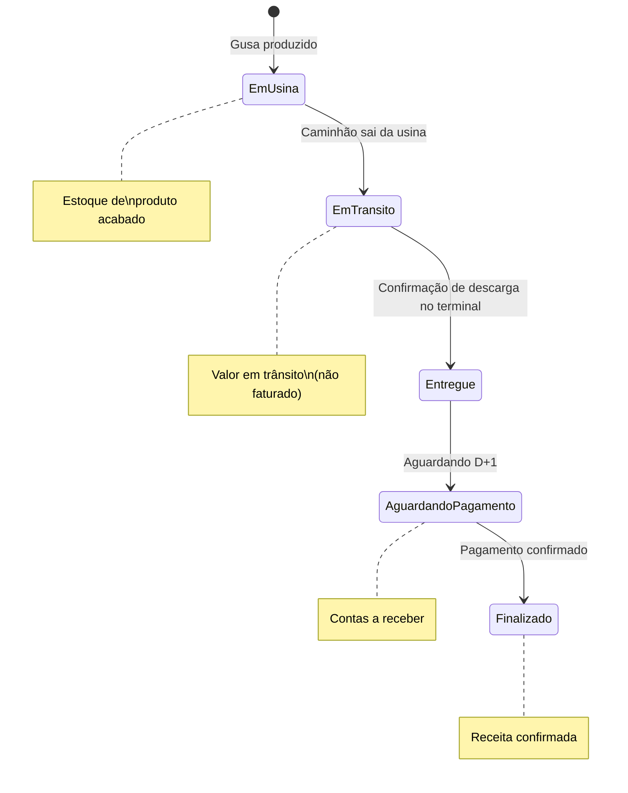
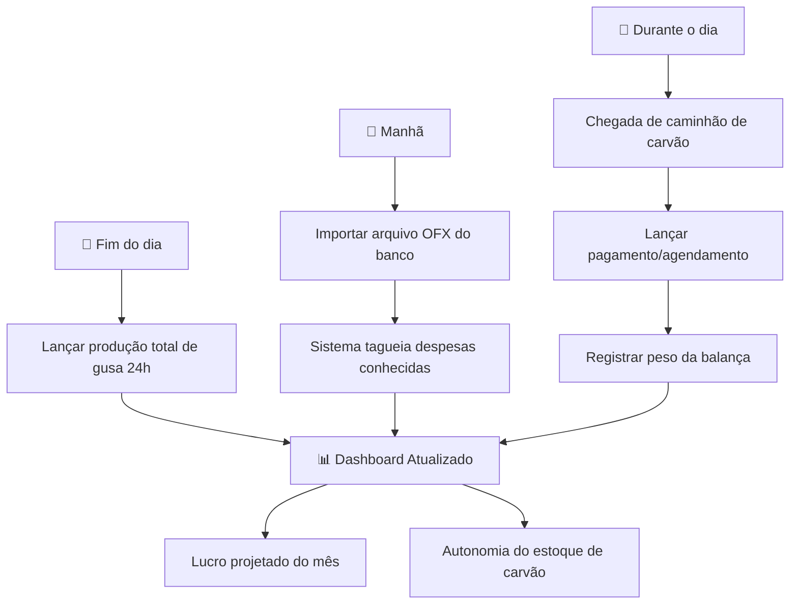

# PRD: Sistema de Gestão Integrada - Gusa Intelligence

> **Versão:** 1.0  
> **Data:** 21 de Janeiro de 2026  
> **Status:** Em Definição

---

## 1. Visão Geral do Produto

O **Gusa Intelligence** é um sistema de gestão interna (ERP simplificado) projetado para substituir o controle via planilhas de uma siderurgia de ferro-gusa. O sistema une a **saúde financeira** ao **desempenho industrial**, permitindo que os gestores tenham visão em tempo real do custo por tonelada produzida e da rentabilidade da operação.

### 1.1 Objetivos Estratégicos

| Objetivo | Descrição |
|----------|-----------|
| **Centralização** | Eliminar o uso de múltiplas planilhas |
| **Visibilidade** | Identificar quais áreas consomem mais recursos |
| **Previsibilidade** | Antecipar buracos no fluxo de caixa |
| **Integração** | Conectar automaticamente o pagamento de insumos ao estoque físico |

---

### 1.2 Módulo Bandeirante | Carvão

> [!IMPORTANT]
> O **Bandeirante | Carvão** é um **módulo operacional independente** que complementa o ecossistema do Sistema Bandeirante, mantendo **separação clara de responsabilidades** em relação ao core financeiro.

#### Visão Geral

O Bandeirante | Carvão é um sistema operacional dedicado à gestão completa do ciclo de compra e descarga de carvão vegetal, desde a negociação com fornecedores até o registro e consolidação histórica das descargas.

#### Objetivos do Módulo

| Objetivo | Descrição |
|----------|-----------|
| **Organização Comercial** | Controlar negociações ativas com fornecedores de carvão |
| **Compliance Jurídico** | Centralizar e rastrear documentação obrigatória e contratos |
| **Agenda Operacional** | Organizar ordem de descarga diária no pátio |
| **Registro Confiável** | Criar base histórica mensal de descargas |
| **Integração** | Fornecer dados operacionais ao Sistema Bandeirante (core) |

#### Escopo e Responsabilidades

**✅ O módulo Bandeirante | Carvão É responsável por:**

- Cadastro e gestão de fornecedores de carvão
- Controle de negociações e status comercial
- Análise e arquivamento de documentação obrigatória
- Gestão da agenda e ordem sequencial de descarga
- Registro detalhado das descargas (metragem, densidade, NF, GCA)
- Consolidação histórica mensal das operações
- Exportação de dados operacionais para relatórios

**❌ O módulo Bandeirante | Carvão NÃO:**

- Calcula custos ou CPT (Custo por Tonelada)
- Lança informações no fluxo de caixa
- Gerencia pagamentos financeiros
- Calcula estoque financeiro
- Substitui o sistema financeiro principal
- Gera relatórios financeiros estratégicos

> [!NOTE]
> **Princípio de Arquitetura:** O Bandeirante | Carvão opera como um sistema **operacional puro**, gerando eventos e dados de negócio que são consumidos pelo core financeiro quando necessário, mas sem acesso ou responsabilidade sobre cálculos financeiros, fluxo de caixa ou indicadores estratégicos.

#### Integração com o Core Financeiro

A integração ocorre exclusivamente através do **compartilhamento de dados operacionais e eventos de negócio**, mantendo a separação de responsabilidades:

**Dados compartilhados do Carvão → Core:**
- Eventos de descarga confirmada (fornecedor, metragem, densidade, NF, GCA)
- Dados de fornecedores para vinculação comercial
- Registros históricos para auditoria e rastreabilidade

**O que o Core faz com esses dados:**
- Atualiza o estoque de carvão
- Utiliza metragem para cálculos de CPT
- Cruza dados operacionais com transações financeiras
- Gera indicadores estratégicos de custo

**Separação clara:**
- O módulo Carvão **não tem acesso** a fluxo de caixa, CPT ou dados financeiros estratégicos
- Usuários do módulo Carvão (compradores, operação de pátio) **não visualizam** informações financeiras sensíveis
- O core financeiro permanece como **única fonte de verdade** para cálculos de custo e indicadores estratégicos

---

## 2. Personas e UX

- **Usuário Principal:** Gestores e Sócios
- **Premissa de Design:** *"Menos é mais"*

> [!IMPORTANT]
> O sistema deve ser operado apenas pela alta gestão, com lançamentos rápidos e dashboards que respondam à pergunta: **"Estamos ganhando dinheiro hoje?"**

---

## 3. Requisitos Funcionais

### 3.1 Módulo Financeiro (Fluxo de Caixa)

#### Lançamento de Despesas/Receitas
- Interface simplificada para entrada de valores
- Campos obrigatórios: Data, Valor, Tipo, Categoria

#### Categorização por Centros de Custo

As categorias serão divididas em **Operacionais (Diretas)**, **Operacionais (Indiretas)** e **Não Operacionais**.

##### A. Operacional Direto (Insumos e Energia) 🏭

> [!NOTE]
> Estes itens impactam **diretamente** o CPT (Custo por Tonelada).

| Subcategoria | Descrição | Exemplos |
|--------------|-----------|----------|
| **Carvão Vegetal** | Principal insumo do processo | Compra de carvão de fornecedores |
| **Minério de Ferro** | Matéria-prima metálica | Minério e sínter |
| **Fundentes** | Aditivos para o processo | Calcário, quartzito |
| **Energia Elétrica** | Essencial para sopro e operação | CEMIG |
| **Fretes de Insumos** | Transporte até a usina | Frete de carvão, minério |

##### B. Operacional Indireto (Manutenção e Consumíveis) 🔧

Gastos necessários para manter a usina rodando, mas que não "entram" no forno.

| Subcategoria | Descrição | Exemplos |
|--------------|-----------|----------|
| **Manutenção Mecânica/Soldas** | Reparos e peças | LG Soldas, usinagem |
| **Manutenção Elétrica** | Materiais e reposição | O Ponto Elétrico |
| **Consumíveis de Operação** | Itens de uso diário | EPIs, ferramentas, lubrificantes |
| **Combustíveis e Lubrificantes** | Diesel e óleos | Pá carregadeira, veículos internos |

##### C. Recursos Humanos (Folha e Benefícios) 👷

| Subcategoria | Descrição | Exemplos |
|--------------|-----------|----------|
| **Salários (Folha Líquida)** | Pagamentos nominais | Funcionários da operação |
| **Encargos e Impostos S/ Folha** | Obrigações trabalhistas | FGTS, INSS, PIS sobre folha |
| **Benefícios e Provisões** | Benefícios dos funcionários | Vales (Assaí/BH), Cestas Básicas, Rescisões, Férias |

##### D. Administrativo e Apoio 📋

| Subcategoria | Descrição | Exemplos |
|--------------|-----------|----------|
| **Serviços Terceirizados** | Apoio externo | Contabilidade (Edicon), Jurídico, Segurança |
| **Taxas e Associações** | Obrigações legais | Sindifer, taxas municipais, alvarás |
| **Tecnologia** | Softwares e infraestrutura | Alteradata, Kinevo, Internet |

##### E. Financeiro e Tributário 💰

| Subcategoria | Descrição | Exemplos |
|--------------|-----------|----------|
| **Tarifas Bancárias** | Custos de movimentação | Taxas de conta, boletos, custódia |
| **Impostos Governamentais** | Tributos não creditados | ICMS, IRPJ, CSLL, DAEs |
| **Juros e Empréstimos** | Custo de capital | Parcelas de financiamentos |

##### F. Não Operacional / Patrimonial 🏦

> [!WARNING]
> Itens que movimentam o caixa mas **não refletem** a eficiência da usina. Devem ser excluídos do cálculo de CPT.

| Subcategoria | Descrição | Exemplos |
|--------------|-----------|----------|
| **Distribuição de Lucros** | Retirada dos sócios | Pró-labore, dividendos |
| **Investimentos/Resgates** | Movimentações patrimoniais | Aplicações financeiras, compra de máquinas |
| **Gastos Pessoais/Sócios** | Não pertence à operação | Financiamento de carro pessoal |

---

#### Conciliação OFX
- Importação de extratos bancários
- Tagueamento rápido de lançamentos recorrentes
- Sugestão automática de categorias baseada em histórico

#### Gestão Tributária
- Campo para indicar se a compra gera crédito de ICMS
- Cálculo automático do valor recuperável

---

#### Controle de Caixa Diário (Fechamento)

> [!IMPORTANT]
> O sistema não deve apenas registrar fluxo — deve manter **snapshots diários** do saldo real para garantir conciliação e rastreabilidade.

##### Conceito de Fechamento Diário

Ao final de cada dia operacional, o gestor realiza o "Fechamento de Caixa", validando se o saldo calculado pelo sistema confere com o saldo real (conta bancária ou caixa físico).

##### Campos do Fechamento

| Campo | Descrição |
|-------|-----------|
| **Data** | Data do fechamento |
| **Saldo Inicial** | Saldo herdado automaticamente do fechamento anterior |
| **Total de Entradas** | Soma das transações tipo `entrada` do dia |
| **Total de Saídas** | Soma das transações tipo `saída` do dia |
| **Saldo Final Calculado** | Saldo Inicial + Entradas - Saídas |
| **Saldo Final Real** | Valor informado pelo gestor (conferência física/bancária) |
| **Diferença** | Saldo Real - Saldo Calculado |
| **Observações** | Justificativa para diferenças |

##### Regra de Transição (Regra de Ouro)

```
Saldo Final Real (D-1) = Saldo Inicial (D)
```

O sistema deve:
1. **Carregar automaticamente** o saldo inicial do dia com base no fechamento anterior
2. **Bloquear edição** do saldo inicial (é derivado, não digitado)
3. **Alertar** quando houver diferença > X% entre calculado e real
4. **Exigir justificativa** se a diferença ultrapassar o limite configurável

##### Primeiro Fechamento (Implantação)

Na primeira utilização, o gestor informa manualmente o saldo inicial de implantação. A partir daí, o sistema assume o controle da transição.

---

#### Visualização no Dashboard (Caixa)

O Dashboard financeiro deve exibir claramente:

| Área | Conteúdo |
|------|----------|
| **Saldo do Dia Anterior** | Último `real_closing_balance` registrado |
| **Movimentação do Dia** | Entradas e Saídas acumuladas até o momento |
| **Saldo Atual Projetado** | Saldo Anterior + Entradas - Saídas (tempo real) |
| **Alerta de Fechamento** | Lembrete se o dia anterior não foi fechado |

### 3.2 Módulo de Gestão Industrial (Produção e Estoque)

#### Cadastro de Matérias-Primas

| Material | Unidade | Atributos |
|----------|---------|-----------|
| Carvão Vegetal | **Metros cúbicos (m³)** | Valor/m³, Alíquota ICMS padrão |
| Minério de Ferro | Toneladas (t) | Valor/tonelada, Alíquota ICMS padrão |
| Fundentes | Toneladas (t) | Valor/tonelada |

#### Integração Financeiro-Industrial

> [!TIP]
> Ao pagar um fornecedor de carvão, o sistema **obriga** o preenchimento da **metragem (m³)**, alimentando o estoque automaticamente.

#### Lançamento de Produção
- Registro diário da quantidade de Ferro-Gusa produzido (Tons)
- Campo opcional para observações técnicas

#### Baixa Automática de Estoque
- O sistema calcula o consumo de carvão baseado em um **índice técnico**
- Exemplo: `0,85t de carvão / 1t de gusa`
- Abatimento automático do estoque a cada lançamento de produção

---

### 3.3 Módulo de Vendas (Contratos e Expedição)

> [!IMPORTANT]
> A siderúrgica opera por **Contratos de Fornecimento** com entregas parceladas. O faturamento ocorre **D+1 após descarregamento no terminal do cliente**, não na saída da usina.

#### Cadastro de Clientes/Compradores
- Nome/Razão Social
- CNPJ
- Endereço do terminal de descarga
- Dados de contato e forma de pagamento preferencial

#### Contratos de Venda

Um contrato representa o acordo comercial de entrega de ferro-gusa ao longo de um período.

| Campo | Descrição |
|-------|-----------|
| **Cliente** | Comprador vinculado |
| **Quantidade Contratada** | Volume total acordado (ex: 5.000 toneladas) |
| **Preço por Tonelada** | Valor unitário negociado (ex: R$ 2.000/ton) |
| **Data de Início** | Início da vigência |
| **Data de Término** | Prazo máximo para entrega |
| **Condições de Pagamento** | Prazo (ex: D+1 após descarga) |
| **Status do Contrato** | Ativo, Pausado, Encerrado |

**Métricas Automáticas por Contrato:**
- Saldo a Entregar (quantidade contratada - quantidade expedida)
- % de Cumprimento
- Valor Faturado vs. Valor Pendente

---

#### Expedição / Romaneio de Saída

Cada expedição representa uma "puxada" — a saída de um caminhão da usina com destino ao terminal do cliente.

| Campo | Descrição |
|-------|-----------|
| **Contrato Vinculado** | A qual contrato essa expedição pertence |
| **Data/Hora de Saída** | Momento da saída da usina |
| **Placa do Caminhão** | Identificação do veículo |
| **Peso de Saída (Balança Usina)** | Peso aferido na saída |
| **Peso de Chegada (Terminal)** | Peso aferido no destino |
| **Quebra de Transporte** | Diferença calculada automaticamente |
| **Status Logístico** | Fluxo detalhado abaixo |
| **Data de Pagamento** | Quando o valor foi efetivamente recebido |

---

#### Fluxo de Status Logístico



| Status | Descrição | Impacto no Sistema |
|--------|-----------|-------------------|
| **Em Usina** | Gusa produzido, aguardando expedição | Estoque de Produto Acabado |
| **Em Trânsito** | Caminhão a caminho do terminal | Baixa do estoque, sem receita ainda |
| **Entregue** | Descarga confirmada, aguardando D+1 | Gera "Contas a Receber" |
| **Aguardando Pagamento** | Dentro do prazo de D+1 | Contas a Receber ativas |
| **Finalizado** | Pagamento creditado em conta | Receita confirmada no fluxo de caixa |

---

#### Controle de Quebra de Peso

> [!WARNING]
> A diferença entre o **peso de saída** (balança da usina) e o **peso de chegada** (balança do terminal) revela perdas de transporte que impactam a margem real.

O sistema deve:
- Registrar ambos os pesos por expedição
- Calcular automaticamente: `quebra = peso_saida - peso_chegada`
- Exibir taxa de quebra média por cliente/rota
- Alertar quando a quebra ultrapassar um limite configurável (ex: > 1%)

---

### 3.4 Relatórios e Dashboards (KPIs)

O sistema deve processar os dados inseridos e gerar:

#### KPIs de Produção e Custos

| KPI | Fórmula/Descrição |
|-----|-------------------|
| **CPT (Custo por Tonelada)** | Soma de gastos do período ÷ Total de gusa produzido |
| **Ponto de Equilíbrio** | Quantidade mínima de produção para pagar os custos fixos |
| **Estoque de Segurança** | Alerta visual quando o carvão atingir nível crítico de dias de produção |

#### KPIs de Vendas e Contratos (Novo)

| KPI | Fórmula/Descrição |
|-----|-------------------|
| **Saldo a Entregar por Contrato** | Quantidade contratada - Quantidade expedida |
| **% de Cumprimento de Contrato** | (Quantidade entregue ÷ Quantidade contratada) × 100 |
| **Valor em Trânsito** | Soma do valor de expedições com status "Em Trânsito" |
| **Contas a Receber** | Soma do valor de expedições com status "Entregue" ou "Aguardando Pagamento" |
| **Quebra Média de Transporte** | Média da diferença percentual entre peso de saída e chegada |
| **Prazo Médio de Recebimento** | Dias entre entrega e pagamento efetivo |
| **Faturamento Realizado vs. Potencial** | Receitas confirmadas vs. total contratado |

---

## 4. Requisitos de Dados (Esquema Simplificado)

### Tabelas Principais

#### `transactions`
| Campo | Tipo | Descrição |
|-------|------|-----------|
| `id` | UUID | Identificador único |
| `date` | DATE | Data da transação |
| `amount` | DECIMAL | Valor da transação |
| `type` | ENUM | Entrada / Saída |
| `category` | VARCHAR | Categoria do centro de custo |
| `status` | VARCHAR | Status do pagamento |
| `weight_linked` | DECIMAL | Peso vinculado (tons) |
| `icms_value` | DECIMAL | Valor do ICMS recuperável |

#### `production`
| Campo | Tipo | Descrição |
|-------|------|-----------|
| `id` | UUID | Identificador único |
| `date` | DATE | Data da produção |
| `tons_produced` | DECIMAL | Toneladas produzidas |
| `technical_notes` | TEXT | Observações técnicas |

#### `inventory`
| Campo | Tipo | Descrição |
|-------|------|-----------|
| `material_id` | UUID | Identificador do material |
| `current_balance_tons` | DECIMAL | Saldo atual em toneladas |
| `last_average_price` | DECIMAL | Último preço médio |

#### `settings`
| Campo | Tipo | Descrição |
|-------|------|-----------|
| `coal_consumption_index` | DECIMAL | Índice de consumo de carvão |
| `monthly_production_goal` | DECIMAL | Meta de produção mensal |
| `estimated_fixed_costs` | DECIMAL | Custos fixos estimados |

---

## 5. Requisitos Não Funcionais

### Segurança
- [ ] Autenticação de dois fatores (2FA) para acesso aos dados financeiros
- [ ] Logs de auditoria para todas as operações críticas

### Mobilidade
- [ ] Layout totalmente responsivo (**Mobile-First**)
- [ ] Otimizado para lançamentos rápidos no pátio da usina

### Disponibilidade
- [ ] Operação em nuvem
- [ ] Backup automático diário
- [ ] SLA de 99.5% de uptime

---

## 6. Fluxo de Operação (Daily Workflow)



### Resumo do Workflow Diário

| Momento | Ação | Responsável |
|---------|------|-------------|
| **Manhã** | Importar OFX e validar tagueamento automático | Gestor Financeiro |
| **Durante o dia** | Lançar pagamentos e pesos de entrada | Gestor Operacional |
| **Fim do dia** | Registrar produção das últimas 24h | Gestor de Produção |
| **Instantâneo** | Dashboard atualiza métricas automaticamente | Sistema |

---

## 7. Roadmap de Evolução

### Fase 1: MVP ✅
> Fluxo de Caixa + Produção + Estoque de Carvão

- [ ] Módulo de lançamento financeiro
- [ ] Categorização por centros de custo
- [ ] Importação OFX básica
- [ ] Cadastro de matérias-primas
- [ ] Lançamento de produção diária
- [ ] Baixa automática de estoque
- [ ] Dashboard com KPIs principais

---

### Fase 2: Automação Bancária 🔄
> Integração automática via API bancária (Open Banking)

- [ ] Conexão com APIs de Open Banking
- [ ] Conciliação automática de transações
- [ ] Alertas de movimentações atípicas

---

### Fase 3: Módulo de Vendas 📦
> Controle de contratos de entrega de gusa

- [ ] Cadastro de clientes
- [ ] Gestão de contratos de fornecimento
- [ ] Acompanhamento de entregas
- [ ] Faturamento integrado

---

## 8. Critérios de Sucesso

| Métrica | Meta |
|---------|------|
| Tempo de lançamento de despesa | < 30 segundos |
| Tempo de fechamento diário | < 5 minutos |
| Precisão do estoque calculado | > 95% vs. inventário físico |
| Adoção pelos usuários | 100% dos gestores em 30 dias |

---

## 9. Riscos e Mitigações

| Risco | Probabilidade | Impacto | Mitigação |
|-------|---------------|---------|-----------|
| Resistência à mudança de planilhas | Média | Alto | Treinamento hands-on + período de transição paralela |
| Índice de consumo impreciso | Baixa | Médio | Permitir ajuste manual do índice por período |
| Falha na importação OFX | Baixa | Baixo | Manter opção de lançamento manual |

---

> [!NOTE]
> Este documento deve ser revisado e atualizado conforme o projeto evolui. Todas as alterações significativas devem ser documentadas no histórico de versões.
